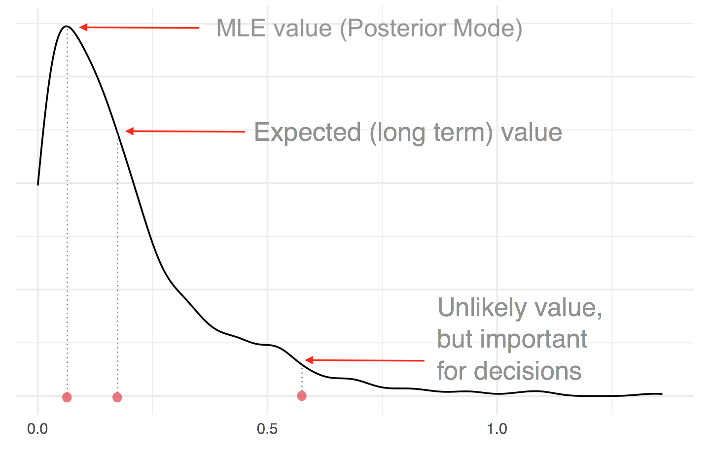
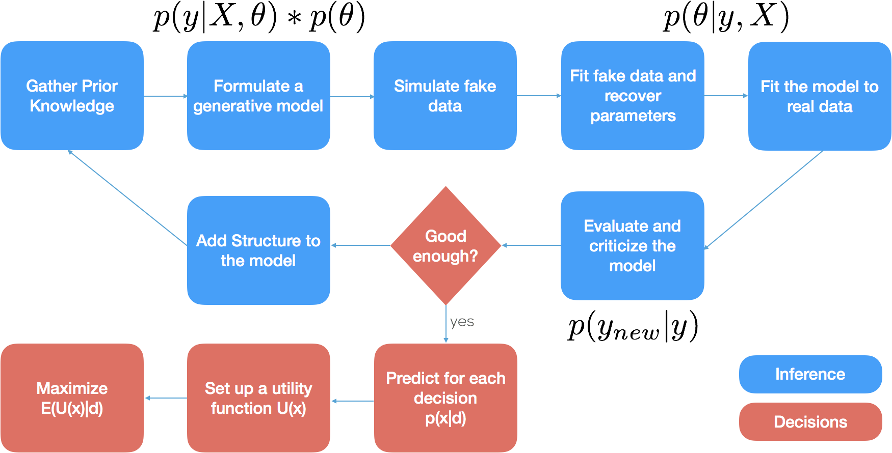
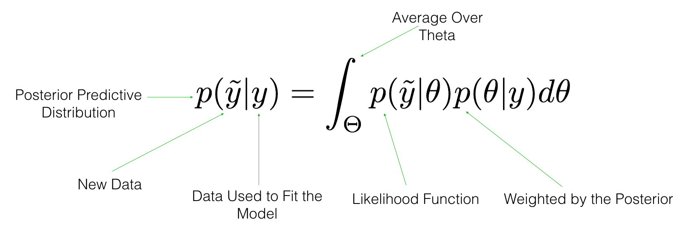

```{r setup, include=FALSE}
library(ggplot2)
library(cowplot)
library(rstan)
library(bayesplot)
options(mc.cores = parallel::detectCores())
rstan_options(auto_write = TRUE)
theme_set(bayesplot::theme_default())
knitr::opts_chunk$set(echo = TRUE, message = FALSE, warning = FALSE)
```

## What is Stan
- Stan is a turing complete, probabilistic programming language that is used mostly for Bayesian inference
- Stan is a two stage compiler: you write your model in the Stan language, which is translated into C++ and then compiled to the native platform
- Stan includes a matrix and math library that supports auto-differentiation
- Stan includes interfaces to R and other languages
- There are post-inference plotting libraries that can be used with Stan like `bayesplot1`
- Stan has thousands of users and growing. Stan is used in clinical drug trials, genomics and cancer biology, population dynamics, psycholinguistics, social networks, finance and econometrics, professional sports, publishing, recommender systems, educational testing, climate models, and many more
- There companies that are building commercial products on top of Stan

## What is Known
- As a matter of notation we call:
    + Observed data $\boldsymbol{y}$
    + Unobserved but observable data $\boldsymbol{\widetilde{y}}$
    + Unobserved and unobservable parameters $\boldsymbol{\theta}$
    + Covariates $\boldsymbol{x}$
    + Probability distribution (density) $\boldsymbol{p(\cdot)}$
- **Estimation** is the process of figuring out the unknowns, i.e. unobserved quantities
- In classical machine learning and frequentist inference (including prediction), the problem is framed in terms of the **most likely value** of $\boldsymbol{\theta}$
- Bayesians are extremely **greedy** people: they are not satisfied with the maximum, the want the whole thing

## Why Bayes
```{r echo=FALSE, out.width='80%', fig.align='center'}

```

## What is Bayes
$$
p(\theta\mid y, X) = \frac{p(y \mid X, \theta) * p(\theta)}{p(y)} = \frac{p(y \mid X, \theta) * p(\theta)}{\int p(y \mid X, \theta) * p(y) \space d\theta} \propto p(y \mid X, \theta) * p(\theta)
$$

- Bayesian inference is an approach to figuring out the updated $\boldsymbol{p(\theta)}$ after observing $\boldsymbol{y}$ and $\boldsymbol{X}$
- When $\boldsymbol{p(y \mid X, \theta)}$ is evaluated at each value of $\boldsymbol{y}$, it is called a likelihood function - this is our data generating process
- An MCMC algorithm draws from an implied probability distribution $\boldsymbol{p(\theta \mid y, X)}$
- In Stan we specify:
$$
\log[p(\theta) * p(y \mid X, \theta)] = \log[p(\theta)] + \sum_{i=1}^{N}\log[p(y_i \mid x_i, \theta)] 
$$
- As you can see, Bayes is not an approach to **modeling**

## You Do Not Need Stan to **Specify** a Model
- Here we specify a Bernoulli model in R and sample from the posterior to infer the proportion $\theta$. You can do same in pretty much any language.

```{r, eval=FALSE}
log_p <- function(theta, data) {
  lp <- 0
  for (i in 1:data$N) 
    lp <- lp + log(theta) * data[i] + log(1 - theta) * (1 - data[i])
  return(lp)
}
data <- c(0, 1, 0, 1, 1); 
theta <- seq(0.001, 0.999, length.out = 250)
log_lik <- log_p(theta = theta, data)
log_prior <- log(dbeta(theta, 1, 1))
log_posterior <- log_lik + log_prior
posterior <- exp(log_posterior)
posterior <- posterior / sum(posterior)
post_draws <- sample(theta, size = 1e5, replace = TRUE, prob = posterior)
```

## Inference vs Making Decisions
- In academia we often care about a estimating some unknown quantity
- In industry, we are often interested in making a decision, not just estimating unknowns
- Decisions need to account for decision maker's preference for risk and take into account exogenous costs and benefits
- Decision problem is logically separate from the inference task. Why?
- You _do not want to_ evaluate utility at the average values of the parameters; instead evaluate the utility at each value of the parameters and then average it. Why?

## Bayesian Workflow
```{r echo=FALSE, out.width='100%', fig.align='center'}

```

## Stan Manual
```{r echo=FALSE, out.width='70%', fig.align='center'}

```

- Let's take a look at the manual

## Linear Regression (Section 9.1)
- Linear regression can be written in many different ways. 
- Linear predictor plus Normal noise
$$
y_n = \alpha + \beta x_n + \epsilon, \space \mathrm{where} \space \epsilon \sim \mathrm{Normal(0, \sigma)} 
$$

- It can also be written in terms of mean and variance

$$ 
\begin{aligned}
y_n &\sim \mathrm{Normal}(\alpha + \beta X_n, \ \sigma) \\
\end{aligned}
$$

- What is missing?

## Linear Regression, Fully Specified
$$ 
\begin{aligned}
y_n &\sim \mathrm{Normal}(\alpha + \beta X_n, \ \sigma) \\
\alpha &\sim \mathrm{Normal}(0, \ 10) \\
\beta &\sim \mathrm{Normal}(0, \ 10) \\
\sigma &\sim \mathrm{Cauchy_+}(0, \ 2.5)
\end{aligned}
$$

- Why did we choose these priors?

## Simple Linear Regression in Stan
```{stan output.var="lin_reg", eval = FALSE}
data {
  int<lower=1> N;
  vector[N] y;
  vector[N] x;
}
parameters {
  real alpha;
  real beta;
  real<lower=0> sigma;
}
model {
  alpha ~ normal(0, 10);    // not in the manual 
  beta ~ normal(0, 10);     // but you should do it
  sigma ~ cauchy(0, 2.5);   
  y ~ normal(alpha + beta * x, sigma);
}
```

## Linear Regression in Stan (Bonus!)
```{stan output.var="lin_reg1", eval = FALSE}
...
generated quantities {
  vector[N] y_rep;
  for(n in 1:N) {
    y_rep[n] = normal_rng(alpha + beta * x[n], sigma);
  }
}
```
```{r echo=FALSE, out.width='80%', fig.align='center'}

```

## Wine Dataset
- Downloaded from: https://archive.ics.uci.edu/ml/datasets/wine+quality
```{r echo=FALSE, out.width='80%', fig.align='center'}

```

## Wine Dataset: What is the Decision
- A particular retailer promised to buy our batch of wine
- But here is a catch: they promise a **\$1** bonus for every bottle that has higher than average quality and would penalize us **\$2** for every bottle that has lower than average rating

## Wine Dataset
```{r, cache=TRUE}
d <- read.delim("winequality-red.csv", sep = ";")
dim(d)
d <- d[!duplicated(d), ] # remove the duplicates
dim(d)
names(d)
```

## Quality Rating of Red Wine
```{r, cache=F, echo=FALSE, fig.align='center', fig.width=10, fig.height=5}
qplot(d$quality, geom = "histogram") + xlab("Quality Rating of Red Wine")
```

## Alcohol Content of Red Wine
```{r, cache=F, echo=FALSE, fig.align='center', fig.width=10, fig.height=5}
qplot(d$alcohol, geom = "histogram") + xlab("Alcohol Content of Red Wine")
```

## Alcohol
```{r, cache=F, echo=FALSE, cache=TRUE, fig.align='center', fig.width=10, fig.height=5}
p <- ggplot(d, aes(alcohol, quality))
p + geom_jitter(alpha = I(0.3)) + xlab("Alcohol") + ylab("Quality (Jittered)")
```

## Volatile Acidity
```{r, cache=F, echo=FALSE, cache=TRUE, fig.align='center', fig.width=10, fig.height=5}
p <- ggplot(d, aes(volatile.acidity, quality))
p + geom_jitter(alpha = I(0.3)) + xlab("Volatile Acidity") + ylab("Quality (Jittered)") 
```

## Scaling the Data
```{r, cache=TRUE}
ds <- scale(d)
ds[1:3, 1:5]
round(apply(ds, 2, function(x) c(mean = mean(x), sd = sd(x))), 2)[, 1:5]
class(ds); ds <- as.data.frame(ds)
```

## Running Stan from R
```{r, eval=FALSE}
library(rstan)
data <- with(ds, list(alcohol = alcohol, quality = quality, N = nrow(ds)))
quality <- ds$quality
m1 <- stan_model("lin_reg.stan")
f1 <- sampling(m1, iter = 300, data = data); saveRDS(f1, file = "f1.Rds")
print(f1) # don't do this for large models
```
```
Inference for Stan model: lin_reg.
4 chains, each with iter=300; warmup=150; thin=1; 
post-warmup draws per chain=150, total post-warmup draws=600.

               mean se_mean   sd    2.5%     25%     50%     75%   97.5% n_eff Rhat
alpha          0.00    0.00 0.02   -0.04   -0.02    0.00    0.01    0.05   533 1.00
beta           0.48    0.00 0.02    0.44    0.46    0.48    0.50    0.52   600 1.00
sigma          0.88    0.00 0.02    0.85    0.87    0.88    0.89    0.91   600 1.00
q_rep[1]      -0.50    0.04 0.86   -2.24   -1.09   -0.48    0.07    1.19   556 1.01
q_rep[2]      -0.33    0.04 0.88   -2.06   -0.95   -0.32    0.23    1.36   600 1.00
q_rep[3]      -0.28    0.04 0.93   -2.05   -0.87   -0.25    0.27    1.63   594 1.00
...
```

## Extracting the Posterior Draws
```{r, cache=TRUE}
library(bayesplot)
f1 <- readRDS("./f1.Rds")
d1 <- extract(f1)
str(d1)
```

## Looking at Parameter Inferences
```{r, echo=TRUE, fig.align='center', fig.height=4, fig.width=10}
p1 <- mcmc_areas(as.data.frame(d1), pars = c("alpha", "beta", "sigma"))
p2 <- mcmc_areas(as.data.frame(d1), pars = c("q_rep.1", "q_rep.2", "q_rep.3"))
cowplot::plot_grid(p1, p2)
```

## What is the Effect of Alcohol on Quality
```{r}
# beta on the original scale
beta_orig <- d1$beta * sd(d$quality) / sd(d$alcohol)
round(mean(beta_orig), 2)
# check with MLE (almost)
round(lm(quality ~ alcohol, data = d)$coeff, 2)
```

## Is This a Good Model
```{r, echo=TRUE, fig.align='center', fig.height=4, fig.width=10}
y <- ds$quality; yrep <- d1$q_rep
p1 <- ppc_dens_overlay(y, yrep[sample(nrow(yrep), 50), ])
p2 <- ppc_ecdf_overlay(y, yrep[sample(nrow(yrep), 50), ]); cowplot::plot_grid(p1, p2)
```

## Is This a Good Model
```{r, echo=TRUE, fig.align='center', fig.height=4, fig.width=10}
p1 <- ppc_stat(y, yrep, stat = "mean")
p2 <- ppc_stat(y, yrep, stat = "sd")
cowplot::plot_grid(p1, p2, labels = c("Mean", "StDev"))
```

## Is This a Good Model
```{r, echo=TRUE, fig.align='center', fig.height=4, fig.width=10}
p1 <- ppc_stat(y, yrep, stat = "max")
p2 <- ppc_stat(y, yrep, stat = "min")
cowplot::plot_grid(p1, p2, labels = c("Max", "Min"))
```

## Is This a Good Model
```{r, echo=TRUE, fig.align='center', fig.height=4, fig.width=10}
i <- sample(nrow(yrep), 50); 
p1 <- ppc_ribbon(y[i], yrep[, i]); p2_1i <- ppc_intervals(y[i], yrep[, i])
cowplot::plot_grid(p1, p2_1i, ncol = 1)
```

## Multiple Linear Regression in Stan
```{stan output.var="lin_reg", eval = FALSE}
data {
  int<lower=1> N;
  int<lower=1> K;
  vector[N] y;
  matrix[N, K] X;
}
parameters {
  real alpha;
  vector[K] beta;
  real<lower=0> sigma;
}
model {
  alpha ~ normal(0, 10);    
  beta ~ normal(0, 10);
  sigma ~ cauchy(0, 2.5);
  y ~ normal(alpha + X * beta, sigma);
}
```

## Running Stan from R
```{r, cache=TRUE, eval=FALSE}
library(rstan)
data <- with(ds, list(X = as.matrix(ds[, 1:11]), 
                      K = ncol(X), N = nrow(ds)), y = quality)
m2 <- stan_model("lin_reg1.stan")
f2 <- sampling(m2, iter = 300, data = data); saveRDS(f2, file = "f2.Rds")
print(f2) # don't do this for large models
```
```
               mean se_mean   sd    2.5%     25%     50%     75%   97.5% n_eff Rhat
alpha          0.00    0.00 0.02   -0.04   -0.02    0.00    0.01    0.04   600 1.00
beta[1]        0.03    0.00 0.06   -0.08   -0.01    0.03    0.07    0.14   284 1.00
beta[2]       -0.25    0.00 0.03   -0.30   -0.27   -0.25   -0.23   -0.19   469 1.00
beta[3]       -0.04    0.00 0.04   -0.12   -0.06   -0.04   -0.01    0.04   406 1.00
beta[4]        0.01    0.00 0.03   -0.04   -0.01    0.01    0.03    0.06   417 1.01
beta[5]       -0.12    0.00 0.03   -0.16   -0.13   -0.12   -0.10   -0.06   600 1.00
beta[6]        0.04    0.00 0.03   -0.02    0.02    0.04    0.06    0.11   485 1.00
...
```
## Extracting the Posterior Draws
```{r, cache=TRUE}
f2 <- readRDS("./f2.Rds")
d2 <- extract(f2)
str(d2)
```

## Examining Parameter Inferences
```{r, echo=FALSE, cache=TRUE, fig.align="center", fig.width=10, fig.height=5}
beta <- d2$beta
colnames(beta) <- names(ds)[1:11]
p1 <- mcmc_areas(beta)
p1
```

## Examining Predictive Inferences
```{r, echo=FALSE, cache=TRUE, fig.align="center", fig.width=10, fig.height=5}
yrep <- as.data.frame(d2$y_rep)
p1 <- mcmc_areas(yrep[, sample(nrow(yrep), 10)])
p1
```

## Have We Improved the Model
```{r, echo=FALSE, fig.align='center', fig.height=4, fig.width=10}
y <- ds$quality; yrep <- d2$y_rep
p1 <- ppc_stat(y, yrep, stat = "max")
p2 <- ppc_stat(y, yrep, stat = "min")
cowplot::plot_grid(p1, p2, labels = c("Max", "Min"))
```

## Have We Improved the Model
```{r, echo=TRUE, fig.align='center', fig.height=4, fig.width=10}
p1 <- ppc_ribbon(y[i], yrep[, i]); p2 <- ppc_intervals(y[i], yrep[, i])
cowplot::plot_grid(p1, p2, ncol = 1)
```

## Have We Improved the Model
```{r, echo=TRUE, fig.align='center', fig.height=4, fig.width=10}
p2 <- ppc_intervals(y[i], yrep[, i])
cowplot::plot_grid(p2_1i, p2, ncol = 1, labels = c("First Model", "Second Model"))
```

## Comparing Mean Square Errors (MSE)
```{r, cache=TRUE}
d1 <- extract(f1)
yrep1 <- d1$q_rep
d2 <- extract(f2)
yrep2 <- d2$y_rep
# MSE for Model 1
round(mean((colMeans(yrep1) - ds$quality)^2), 2)
# MSE for Model 2
round(mean((colMeans(yrep2) - ds$quality)^2), 2)
```

## Comparing Posterior Intervals
```{r}
width <- function(yrep, q1, q2) {
  q <- apply(yrep, 2, function (x) quantile(x, probs = c(q1, q2)))
  width <- apply(q, 2, diff)
  return(mean(width))
}
round(width(yrep1, 0.25, 0.75), 2)
round(width(yrep2, 0.25, 0.75), 2)
```

## So, What's Up with Sulfates
```{r, echo=FALSE, cache=TRUE, fig.align="center", fig.width=10, fig.height=5}
p1 <- mcmc_areas(beta)
p1
```

## Decision Time
- A particular retailer promised to buy our batch of wine
- But here is a catch: they promise a **\$1** bonus for every bottle that has higher than average quality and would penalize us **\$2** for every bottle that has lower than average rating
- Should we sell to this retailer?
We need to compute the expected net revenue, $\boldsymbol{R}$. For one bottle we have:
$$
\mathbf{E}(R) = \mathrm{Pr(q > 0) * bonus} - \mathrm{Pr(q < 0) * penalty} 
$$
For the whole batch:
$$
\mathbf{E}(R) = \sum_{i=1}^{N}[\mathrm{Pr(q_i > 0) * bonus} - \mathrm{Pr(q_i < 0) * penalty}]
$$

## Computing Expected Revenue
```{r, echo=TRUE, fig.align='center', fig.height=3, fig.width=10}
bottle1 <- yrep2[, 1] 
qplot(bottle1, alpha = (I=0.5)) + geom_vline(xintercept = 0, colour = "red")
mean(bottle1 > 0) # Expectation over indicator function
mean(bottle1 < 0)
```

## Computing Expected Revenue
```{r, echo=TRUE, fig.align='center', fig.height=3, fig.width=10}
Pr_bonus <- apply(yrep2, 2, function(x) mean(x > 0))
Pr_penalty <- 1 - Pr_bonus; rev <- Pr_bonus * 1 - Pr_penalty * 2
qplot(rev, alpha = (I=0.5)) + geom_vline(xintercept = 0, colour = "red")
round(sum(rev))
```

## Thank you!
- Get in touch
- eric@generable.com
- @ericnovik on Twitter

